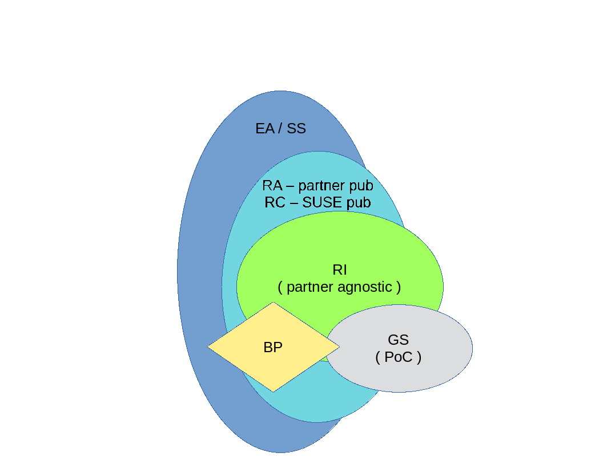

# RancherDocsRep1

Content:
- Rancher (refer to [DC-TRD-RA-Rancher](./DC-TRD-RA-Rancher) for a general DAPS configuration template) (for SUSE Rancher, the multi-cluster management server)
  - Getting Started [GS-Rancher_color_draft_en.pdf](./example/GS-Rancher_color_draft_en.pdf)
    - simplified deployment for a PoC or just to try functionality
  - Reference Implementation [RI-Rancher_color_draft_en.pdf](./example/RI-Rancher_color_draft_en.pdf)
    - stacked deployment of SUSE components as a basis for production
  - Reference Configuration [RC-Rancher_color_draft_en.pdf](./example/RC-Rancher_color_draft_en.pdf)
    - incorporate partner offerings with SUSE components for a more complete solution
- Next Up - RKE (WIP)

Output Creation:

- Assumptions
  - review tutorial - https://github.com/bwgartner/AsciiDoc-to-DAPS
  - install DocBook Authoring and Publishing Suite DAPS ( https://github.com/openSUSE/daps )
  - the overall template is based upon the RA flavor of Solution Architecture template ( https://github.com/bwgartner/SA-template )
- Process
  - git clone this repo (and either regularly fetch/pull to stay current)
    - many technical reference documents (TRD) can come from this repository
  - change directory to the local path where the content resides
  - determine which type of document to generate ,  see [SA-Glossary.adoc](./adoc/SA-Glossary.adoc) for descriptions
    - Getting Started (GS)
    - Reference Implmentation (RI)
    - Reference Configuration (RC) ... citing this example for the remainder
  - modify the file adoc/SA_vars.adoc to represent the top level SUSE product
    - e.g. :focus: {an_Rancher} as noted in ./SUSE/Rancher/SA_vars.adoc
  - copy the DAPS configuration file to an appropriate name
    - e.g. DC-TRD-RA-Rancher to DC-TRD-RC-Rancher
      - to create an output format that has the associated naming (e.g. TRD-RC-Rancher.suffix)
  - edit the new, respective DAPS configuration file
    - uncomment the desire document type
      - ADOC_ATTRIBUTES+=" --attribute RC=1"
    - for an RC variant, you will likely also need to adjust inclusion of partner attributes (ISV, IHV, CSP)
      - e.g. for an IHV partner
        - ADOC_ATTRIBUTES+=" --attribute iIHV=1"
        - ADOC_ATTRIBUTES+=" --attribute IHV-HPE=1"
        - ADOC_ATTRIBUTES+=" --attribute IHV-HPE-Synergy=1"
  - generate the desired output format (assume you already have 
    - NOTE: address any syntax issues until a successful build happens
    - daps --force -d DC-TRD-RC-Rancher epub
    - daps --force -d DC-TRD-RC-Rancher html
    - daps --force -d DC-TRD-RC-Rancher html --single
    - daps --force -d DC-TRD-RC-Rancher pdf
    - look in the generated ./build/ directory mentioned in the CLI standard output

Then you can progressively edit the various snippets throughout the structure that are associated ith the attributes you enable and name/value pairs and regenerate the output formats.
	

